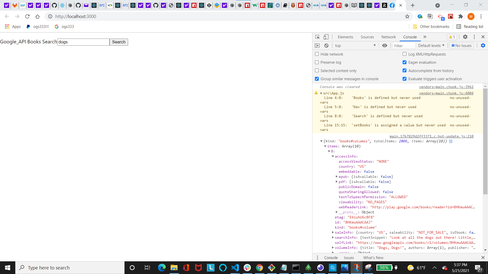

# GoogleAPIBooks

## Jennifer Detmering

## Description-

### Searches for Books and Saves them to a Book list using Google Books API

#### []

## Table of Contents

1. [Installation](#installation)
2. [Usage](#usage)
3. [Technologies Used](#technologies_used)
4. [Credits](#credits)
5. [License](#license)
6. [Features](#features)
7. [Questions and Contributions](#questions_and_contributions)
8. [Tests](#tests)

## Installation-

## Usage-

## Technologies Used-

npm, CSS, JavaScript, node.js, Google Books API, React.js

## Credits-

[w3 schools](https://w3schools.com)

## License-

### [License: MIT](https://opensource.org/licenses/MIT)

## Features-

Uses Google API Books to search for books and save them to a reading wish list.

## Questions and Contributions-

### GitHub Profile: https://github.com/kodiakshuksan

### Email: kodiakshuksan@yahoo.com

## Tests-

none
